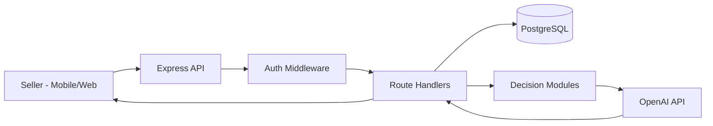

# Seller Inbox AI

AI assistant for social-commerce sellers that generates accurate, context-aware customer reply suggestions using real product, variant, and delivery data.

## Recruiter Snapshot

- Built a **full-stack AI product** (Flutter + React + Node.js + PostgreSQL + OpenAI)
- Implemented a **decision layer** (`REPLY` vs `ASK`) to reduce unsafe AI outputs
- Designed for **real seller workflows**: fast suggestions, human approval, no blind auto-send
- Structured as a scalable architecture with clean separation across UI, API, business logic, and data

---

## Table of Contents

1. [Project Title](#project-title)
2. [Problem Statement](#problem-statement)
3. [Solution Overview](#solution-overview)
4. [System Architecture](#system-architecture)
5. [End-to-End Request Flow](#end-to-end-request-flow)
6. [Key Features](#key-features)
7. [Tech Stack](#tech-stack)
8. [Folder Structure Overview](#folder-structure-overview)
9. [Important Backend Modules](#important-backend-modules)
10. [Database Design](#database-design)
11. [API Summary](#api-summary)
12. [Local Setup Instructions](#local-setup-instructions)
13. [Demo Usage Flow](#demo-usage-flow)
14. [Future Improvements](#future-improvements)


---

## Project Title

**Seller Inbox AI**  
An AI-assisted reply platform for Instagram-first sellers that combines inventory truth with controlled text generation.

---

## Problem Statement

Small online sellers repeatedly answer questions like:
- “Price kati ho?”
- “Blue size M available cha?”
- “Delivery charge kati?”

This creates three problems:

1. **Response time**: manual replies are slow during high DM volume.
2. **Consistency**: tone and wording vary across conversations.
3. **Accuracy risk**: generic AI can hallucinate product or stock details.

---

## Solution Overview

Seller Inbox AI uses a hybrid approach:

- **Structured commerce data** from PostgreSQL (products, variants, delivery zones)
- **Rule-based guardrails** (product resolver + confidence + decision engine)
- **Prompt-constrained generation** via OpenAI with strict output behavior

Result: sellers get fast suggestions without losing control. AI assists; seller approves.

---

## System Architecture

### Core Systems

1. **Mobile App (Flutter)**
   - Main UI for AI reply generation and catalog management.
   - Key screens:
     - `mobile/lib/screens/ai_reply_screen.dart`
     - `mobile/lib/screens/product_management_screen.dart`
     - `mobile/lib/screens/delivery_zones_screen.dart`

2. **Web App (React + Vite)**
   - Authenticated dashboard for AI replies, products, and delivery zones.
   - Key files:
     - `web/src/pages/Dashboard.tsx`
     - `web/src/pages/Products.tsx`
     - `web/src/pages/DeliveryZones.tsx`
     - `web/src/services/api.ts`

3. **Backend API (Node.js + Express + TypeScript)**
   - Authentication, CRUD operations, AI orchestration, and business rules.
   - Entry points:
     - `backend/src/server.ts`
     - `backend/src/app.ts`

4. **Database (PostgreSQL)**
   - Source of truth for user, product, stock, and delivery context.
   - Connection utility: `backend/src/utils/db.ts`

5. **AI Service (OpenAI API)**
   - Called from `backend/src/routes/ai.ts`
   - Controlled by `backend/src/ai/systemprompt.ts`

### Architecture Diagram



---

## End-to-End Request Flow

Example: **Generate AI reply suggestion**

1. Seller pastes customer message in UI.
2. Client sends `POST /api/ai/suggest-reply` with JWT.
3. Auth middleware validates token and attaches `req.userId`.
4. Backend fetches products + variants + delivery context from DB.
5. Product resolver checks if message references known product context.
6. Intent detection + confidence scoring run.
7. Decision engine chooses:
   - `ASK` -> clarification response
   - `REPLY` -> proceed to OpenAI
8. If `REPLY`, backend sends constrained prompt + structured context to OpenAI.
9. Backend returns suggestions JSON.
10. UI renders options and seller copies preferred response.

---

## Key Features

### AI Reply Engine
- Suggests 1–2 seller-ready replies from pasted customer messages.
- Uses structured business context to reduce hallucination.
- Supports Nepali-English communication style.

### Product & Inventory Management
- Create/list/delete products.
- Add variants (color/size) per product.
- Toggle variant availability (in stock / sold out).

### Delivery Configuration
- Create/update/delete delivery zones.
- Maintain COD availability per zone.
- Supports fallback delivery settings.

### Authentication
- Signup/login with JWT.
- Protected API endpoints with middleware authorization.

### Safety and Reliability Layer
- Product resolver to detect known product context.
- Confidence scoring for response reliability.
- Decision engine to block unsafe reply generation.

### Multi-Client Support
- Flutter mobile workflow.
- React web dashboard workflow.

---

## Tech Stack

### Frontend
- Flutter (Dart)
- React + TypeScript + Vite

### Backend
- Node.js
- Express
- TypeScript

### Data Layer
- PostgreSQL
- `pg`

### AI
- OpenAI API (`gpt-4o-mini`)

### Auth & Security
- JWT (`jsonwebtoken`)
- Password hashing (`bcrypt`)

### Supporting Libraries
- `cors`, `dotenv`, `http` (Flutter), React Router

---

## Folder Structure Overview

```text
mobile/
  lib/
    screens/        # Flutter UI screens (reply, products, variants, delivery)
    services/       # API wrapper classes (used by selected screens)

backend/
  src/
    routes/         # API endpoints (auth, ai, products, variants, delivery)
    middleware/     # Auth middleware and request protection
    ai/             # AI prompt policy
    decision/       # Decision engine + confidence scoring
    product/        # Product context resolution
    utils/          # Shared utilities (DB connection)
    migrations/     # SQL migrations

web/
  src/
    pages/          # UI pages and dashboard tabs
    services/       # API client abstraction
    context/        # Auth/session state management
    styles/         # Global styles

docs/
  *.md              # Product strategy, API contract, MVP rule docs
```

---

## Important Backend Modules

### `backend/src/routes/ai.ts`
AI orchestration layer:
- Loads DB context
- Runs intent + decision pipeline
- Calls OpenAI
- Returns suggestions and decision metadata

### `backend/src/product/productResolver.ts`
Checks if the message has identifiable product context (text/media/source rules).

### `backend/src/decision/decisionEngine.ts`
Business guardrail for `REPLY` vs `ASK` decisioning.

### `backend/src/decision/confidence.ts`
Computes confidence level from product-known and intent signals.

### `backend/src/ai/systemprompt.ts`
Enforces tone, language, and truthfulness constraints for AI output.

### `backend/src/middleware/auth.ts`
Validates JWT and injects authenticated user context into requests.

---

## Database Design

| Table | Purpose | Example Fields |
|---|---|---|
| `users` | Seller identity and account data | `id`, `name`, `email`, `password`, `created_at` |
| `products` | Seller product catalog | `id`, `user_id`, `name`, `price` |
| `variants` | Product stock units | `id`, `product_id`, `color`, `size`, `available` |
| `delivery_zones` | Zone-based shipping and COD policy | `id`, `user_id`, `name`, `price`, `cod_available` |
| `delivery_settings` | Legacy/fallback delivery pricing | `user_id`, `within_city_price`, `outside_city_price`, `cod_available` |

Included migration:
- `backend/src/migrations/create_delivery_zones.sql`

---

## API Summary

### Auth
- `POST /api/auth/signup`
- `POST /api/auth/login`
- `GET /api/auth/me`

### AI
- `POST /api/ai/suggest-reply`

### Products
- `GET /api/products`
- `POST /api/products`
- `DELETE /api/products/:id`

### Variants
- `GET /api/products/:productId/variants`
- `POST /api/products/:productId/variants`
- `PATCH /api/variants/:variantId`

### Delivery
- `GET /api/delivery-zones`
- `POST /api/delivery-zones`
- `PATCH /api/delivery-zones/:id`
- `DELETE /api/delivery-zones/:id`
- `GET /api/delivery-settings`
- `PUT /api/delivery-settings`

---

## Local Setup Instructions

### Prerequisites
- Node.js 18+
- Flutter SDK 3+
- PostgreSQL 14+

### 1) Clone repository

```bash
git clone <your-repo-url>
cd seller-inbox-ai
```

### 2) Install dependencies

```bash
# Backend
cd backend && npm install

# Web (optional)
cd ../web && npm install

# Mobile
cd ../mobile && flutter pub get
```

### 3) Configure backend environment

Create `backend/.env`:

```env
PORT=4000
JWT_SECRET=your_jwt_secret_here
OPENAI_API_KEY=your_openai_api_key_here
```

> Note: DB credentials are currently hardcoded in `backend/src/utils/db.ts` and should be moved to env vars for production.

### 4) Prepare database

1. Create PostgreSQL DB (default expected: `seller_inbox`).
2. Create required tables (`users`, `products`, `variants`, `delivery_settings`, `delivery_zones`).
3. Run migration:

```bash
psql -d seller_inbox -f backend/src/migrations/create_delivery_zones.sql
```

### 5) Run backend

```bash
cd backend
npm run dev
```

Backend URL: `http://localhost:4000`

### 6) Run clients

```bash
# Flutter mobile
cd mobile
flutter run

# React web (optional)
cd web
npm run dev
```

Web URL: `http://localhost:3000` (proxies `/api` to backend)

---

## Demo Usage Flow

1. Seller logs in (mobile or web).
2. Seller adds products and variants.
3. Seller configures delivery zones and COD availability.
4. Seller pastes incoming customer message.
5. Seller clicks **Generate Reply**.
6. Backend validates context and decision rules.
7. AI suggestions are returned.
8. Seller copies and sends preferred response manually.

---

## Future Improvements

- Move hardcoded tokens/base URLs/DB config to secure environment-based config.
- Add refresh token flow and stronger session management.
- Add automated tests and CI/CD.
- Add analytics dashboard (reply time, conversion, FAQ heatmap).
- Add multi-turn conversation context memory.
- Upgrade intent detection from keyword rules to model-assisted classification.
- Add multi-channel integrations (Instagram API/webhooks, WhatsApp, Messenger).
- Add policy-driven automation with seller approval thresholds.

---


