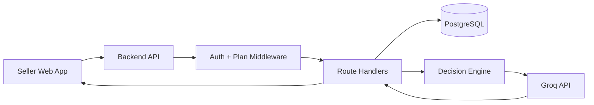

# Smart Reply Assistant (Seller Inbox AI)

AI-powered reply generation for Nepali Instagram and WhatsApp sellers.

This repository contains the Web MVP, backend API, admin panel, payment system, and supporting infrastructure. The product helps sellers generate fast, accurate, context-aware replies while keeping full human control.

> **Source of Truth:** `MASTER_SPEC.md`
> When documentation conflicts, `MASTER_SPEC.md` always wins.

---

# Current Status

| Item                      | Status                                 |
| ------------------------- | -------------------------------------- |
| Master Spec Version       | 3.2 (June 2026)                        |
| Web MVP                   | ✅ Built                                |
| Backend Deployment        | ✅ Configured                           |
| Admin Panel               | ✅ Built                                |
| Manual QR Payments        | ✅ Live                                 |
| eSewa Backend Integration | ✅ Built                                |
| eSewa Checkout UI         | ❌ Not wired                            |
| Khalti                    | ❌ Not built                            |
| Flutter Mobile App        | ⏸ Paused until monetization stabilizes |

---

# Product Vision

Smart Reply Assistant helps Nepali online sellers generate fast, accurate, and consistent customer replies without manually typing the same answers repeatedly.

Common seller questions:

* Price kati ho?
* Yo color available cha?
* Yo size cha?
* Delivery charge kati?
* COD cha?

Generic AI tools often hallucinate prices, stock, and delivery details. Smart Reply Assistant prevents this by combining structured seller data with a confidence-based decision engine.

---

# Core User Flow

```text
1. Customer sends WhatsApp/Instagram message
2. Seller copies message
3. Seller opens Smart Reply Assistant
4. Seller pastes message
5. Seller selects tone
6. Seller clicks Generate
7. AI attempts automatic product matching
8. If confidence is high → reply generated
9. If confidence is low → clarification + quick product picks shown
10. Seller copies reply and sends manually
```

Important:

* No auto-send
* AI auto-matches products first
* Product picker is a recovery mechanism
* Search is fallback only
* Designed primarily for first customer inquiries

---

# Features Implemented

## Authentication

* Signup
* Login
* Logout
* Refresh token rotation
* HttpOnly access and refresh cookies
* CSRF protection
* Protected routes

## Product Management

* Products
* Keywords
* Notes
* Pricing
* Quick Add parser
* Editable product previews

## Variant Management

* Color × Size variant generation
* Availability toggles
* Bulk stock actions
* Optimistic updates

## Delivery Management

* Delivery zones
* Per-zone pricing
* COD settings

## AI System

* AI reply generation
* Tone selector
* Product resolver
* Confidence scoring
* Decision engine
* Product clarification flow
* Quick product picker recovery
* Context Memory V1
* Follow-up context support

## Payments & Monetization

* Manual QR payment flow
* Admin approval workflow
* Subscription system
* Free/Pro enforcement
* Upgrade page
* Paywall modal
* Payment success/failure pages

## Admin Panel

* Admin authentication
* Super admin roles
* User management
* Transaction approval/rejection
* Subscription management
* AI usage monitoring
* System settings
* Audit logging

---

# Plans & Pricing

## Usage Limits

| Feature        | Free      | Pro       |
| -------------- | --------- | --------- |
| AI Replies/Day | 20        | Unlimited |
| Products       | 5         | Unlimited |
| Variants       | Unlimited | Unlimited |
| Delivery Zones | Unlimited | Unlimited |

Limits are controlled through:

```text
system_settings.free_tier_limits
```

When enforcement is disabled, the application runs in trust mode.

## Pricing

| Plan        | Price          |
| ----------- | -------------- |
| Free        | Rs. 0/month    |
| Pro Monthly | Rs. 299/month  |
| Pro Yearly  | Rs. 2,499/year |

---

# Tech Stack

| Layer            | Technology                          |
| ---------------- | ----------------------------------- |
| Frontend         | React 18 + Vite + TypeScript        |
| Styling          | Custom CSS                          |
| Mobile           | Flutter 3 + Dart (Paused)           |
| Backend          | Node.js 20 + Express 4 + TypeScript |
| Database         | PostgreSQL 15                       |
| Data Access      | Raw SQL via pg                      |
| AI               | Groq SDK                            |
| Model            | llama-3.3-70b-versatile             |
| Auth             | JWT + bcryptjs                      |
| Frontend Hosting | Vercel                              |
| Backend Hosting  | Vercel Serverless                   |
| Database Hosting | Neon PostgreSQL                     |

---

# Architecture



---

# AI Reply Pipeline

Endpoint:

```http
POST /api/ai/suggest-reply
```

Flow:

```text
1. checkReplyLimit()
2. Load products, variants, delivery zones
3. Optional forcedProduct/forcedProductId
4. resolveProductContext()
5. detectIntent()
6. calculateConfidence()
7. decideReply()

If ASK:
  → clarification
  → quick product picker

If REPLY:
  → generate AI response

8. incrementReplyCount()
```

Supported request hints:

* forcedProduct
* forcedProductId
* recentProducts
* followUpContext

AI Configuration:

```text
Model: llama-3.3-70b-versatile
Temperature: 0.3
```

---

# Language Rules

Critical:

* Romanized Nepali only
* Never Devanagari
* Always use Hajur
* Never use:

  * bhai
  * dai
  * didi
  * sir
  * madam
* Never invent:

  * price
  * stock
  * size
  * color
  * delivery fee
  * COD availability

If uncertain, ask clarification.

---

# Database Schema

Core Tables:

```text
users
admin_users
auth_refresh_tokens
products
variants
delivery_zones
subscriptions
usage_daily
transactions
ai_usage_logs
system_settings
audit_logs
```

Critical Rules:

```text
One variant row = one color + one size

Correct:
Red | XL

Wrong:
Red,Blue | XL
```

`delivery_settings` has been removed permanently.

Only `delivery_zones` should be used.

---

# API Summary

## Auth

```http
POST /api/auth/signup
POST /api/auth/login
POST /api/auth/refresh
POST /api/auth/logout
POST /api/auth/forgot-password
GET  /api/auth/me
PATCH /api/auth/me
```

## Products

```http
GET    /api/products
POST   /api/products
PATCH  /api/products/:id
DELETE /api/products/:id
```

## Variants

```http
GET   /api/products/:id/variants
POST  /api/products/:id/variants
PATCH /api/variants/:id
```

## Delivery Zones

```http
GET    /api/delivery-zones
POST   /api/delivery-zones
PATCH  /api/delivery-zones/:id
DELETE /api/delivery-zones/:id
```

## AI

```http
POST /api/ai/suggest-reply
```

## Payments

```http
GET  /api/payments/plans
GET  /api/payments/manual-qr/config
GET  /api/payments/manual-qr/status
POST /api/payments/manual-qr/submit
POST /api/payments/esewa/initiate
POST /api/payments/esewa/verify
```

## Admin

```http
POST /api/admin/auth/login
POST /api/admin/auth/refresh
POST /api/admin/auth/logout
GET  /api/admin/auth/me
POST /api/admin/auth/change-password
POST /api/admin/auth/change-email
POST /api/admin/auth/create-admin
```

Response Conventions:

```json
{
  "error": "message"
}
```

Paywall:

```json
{
  "error": "Daily limit reached",
  "upgrade": true
}
```

---

# Security

Implemented:

* bcrypt password hashing
* JWT authentication
* HttpOnly cookies
* CSRF protection
* Refresh token rotation
* Ownership validation
* Role-based admin authentication
* Helmet.js
* Restricted CORS
* Request validation
* Rate limiting
* Duplicate payment prevention
* Server-side plan enforcement
* customerMessage length protection

Token Lifecycle:

```text
Access Token: 15 minutes
Refresh Token: 14 days

Admin Refresh Token:
7 days
```

---

# Environment Variables

```env
PORT
DATABASE_URL
JWT_SECRET
ADMIN_JWT_SECRET
ADMIN_EMAIL
ADMIN_PASSWORD
GROQ_API_KEY
ESEWA_MERCHANT_CODE
ESEWA_SECRET_KEY
MANUAL_QR_IMAGE_URL
MANUAL_QR_RECEIVER_NAME
MANUAL_QR_RECEIVER_ID
MANUAL_QR_SUPPORT_TEXT
FRONTEND_URL
CORS_ORIGINS
ENABLE_DEBUG_ROUTES
ENABLE_STARTUP_VERBOSE_LOGS
NODE_ENV
```

Optional Debug:

```env
ENABLE_AI_SELECTION_DEBUG=true
VITE_AI_SELECTION_DEBUG=true
```

---

# Local Development

Prerequisites:

* Node.js 20+
* Docker Desktop

## Start Database

```bash
cd backend
docker-compose up -d
```

## Start Backend

```bash
cd backend
npm install
npm run dev
```

Backend:

```text
http://localhost:4000
```

## Start Frontend

```bash
cd web
npm install
npm run dev
```

Frontend:

```text
http://localhost:3000
```

---

# Deployment

| Service  | Platform          |
| -------- | ----------------- |
| Frontend | Vercel            |
| Backend  | Vercel Serverless |
| Database | Neon PostgreSQL   |

Production Stack:

```text
Frontend
  ↓
Vercel

Backend
  ↓
Vercel Serverless

Database
  ↓
Neon PostgreSQL
```

---

# Monitoring

Available:

```text
/health
/api/debug
Vercel Logs
console.error()
```

Future:

* Sentry
* PostHog
* Winston

---

# Known Issues

| Issue                             | Status  |
| --------------------------------- | ------- |
| Flutter contains hardcoded JWT/IP | Open    |
| eSewa checkout UI not wired       | Open    |
| Khalti not implemented            | Open    |
| No Sentry integration             | Planned |

---

# Roadmap

## Phase 1

✅ Web MVP

## Phase 2

✅ Monetization Built

Remaining:

* eSewa production testing
* Khalti
* Real seller testing

## Phase 3

* Tailwind migration
* Reply templates
* Sentry
* PostHog
* Additional rate limiting

## Phase 4

* Resume Flutter
* Feature parity

## Phase 5

* WhatsApp integration
* Instagram integration
* Team accounts
* Automation safeguards

---

# Critical Development Rules

Never Forget:

1. No Prisma — use raw pg
2. Groq, not OpenAI
3. Model = llama-3.3-70b-versatile
4. ESM imports require .js extensions
5. AI auto-matches products first
6. Romanized Nepali only
7. Never use bhai/dai/didi
8. Variants = one color + one size
9. delivery_settings is removed
10. Cookie-based auth + CSRF
11. Neon requires SSL
12. Manual QR is primary payment path
13. Frontend = Vercel
14. Backend = Vercel Serverless
15. Database = Neon PostgreSQL
16. Route file is payment.ts (not payments.ts)

---

# Additional Documentation

```text
MASTER_SPEC.md
docs/ai-rules.md
docs/API_contract.md
docs/MVP_DECISION_RULES.md
docs/SHIP_TESTING_GUIDE.md
docs/product_context.md
```

When documentation conflicts, `MASTER_SPEC.md` wins.


