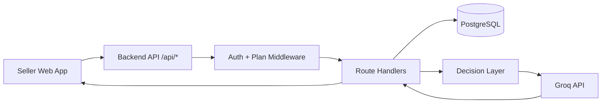

# Smart Reply Assistant (Seller Inbox AI)

AI-powered reply generation for Nepali Instagram and WhatsApp sellers.

This repository contains the current Web MVP, backend API, and paused Flutter app. The product helps sellers generate fast, accurate, context-aware replies while keeping full human control.

## Current Status

- Master spec version: 3.1 (March 2026)
- Web MVP: built
- Monetization (eSewa + plans): built
- Flutter: paused until web monetization is stable
- Source of truth: MASTER_SPEC.md

## Why This Product Exists

Small sellers repeatedly answer the same questions:

- Price kati ho?
- Yo color/size available cha?
- Delivery charge kati?
- COD cha?

Manual replies are slow and inconsistent. Generic AI can hallucinate stock or pricing. Smart Reply Assistant solves this by combining strict business context from database data with a decision layer that blocks low-confidence replies.

## Core Product Flow

1. Customer sends message on Instagram or WhatsApp.
2. Seller copies the message into Smart Reply Assistant.
3. Seller selects a tone (Friendly, Professional, Persuasive).
4. Seller taps Generate.
5. Backend resolves product context and confidence.
6. System decides:
   - REPLY: generate AI suggestion
   - ASK: return clarification question
7. Seller copies the result and sends manually.

Important:

- No product selector in AI flow.
- AI auto-matches product using name and keywords.
- If unclear, system asks clarification instead of guessing.
- No auto-send in MVP.

## Key Features (Implemented)

- Authentication: signup, login, JWT, protected routes
- Products: name, price, keywords, notes
- Variants: color-size rows, availability toggles, bulk actions
- Delivery zones: per-zone charge and COD settings
- AI reply generation with tone selector
- Product resolver + confidence scoring + decision engine
- eSewa payment (initiate + verify)
- Free/Pro limits and plan enforcement middleware
- Upgrade flow and paywall handling in web app

## Plan and Pricing

| Feature | Free | Pro |
|---|---|---|
| AI replies/day | 20 | Unlimited |
| Products | 5 | Unlimited |
| Variants | Unlimited | Unlimited |
| Delivery zones | Unlimited | Unlimited |

| Plan | Price |
|---|---|
| Free | Rs. 0/month |
| Pro Monthly | Rs. 299/month |
| Pro Yearly | Rs. 2,499/year |

## Tech Stack

| Layer | Technology |
|---|---|
| Web | React 18 + Vite + TypeScript |
| Mobile (paused) | Flutter 3 + Dart |
| Backend | Node.js 20 + Express 4 + TypeScript |
| Database | PostgreSQL 15 |
| Data Access | Raw SQL via pg |
| AI | groq-sdk, model llama-3.3-70b-versatile |
| Auth | jsonwebtoken + bcryptjs |
| Hosting | Vercel (frontend + backend serverless) + Neon PostgreSQL |

## High-Level Architecture



## AI Decision and Safety Pipeline

Endpoint: POST /api/ai/suggest-reply

1. checkReplyLimit middleware validates daily quota.
2. Backend loads product, variant, and delivery zone context.
3. resolveProductContext detects productKnown and matchedProduct.
4. detectIntent classifies PRICE, AVAILABILITY, DELIVERY, COD, GENERAL.
5. calculateConfidence returns HIGH, MEDIUM, or LOW.
6. decideReply returns REPLY or ASK.
7. If ASK: generate short clarification.
8. If REPLY: generate response using system prompt + structured context.
9. incrementReplyCount updates usage_daily.

## Language and Output Rules (Critical)

- Romanized Nepali only, never Devanagari script.
- Never use bhai, dai, didi, sir, madam.
- Use respectful Hajur style.
- Never invent price, stock, size, color, delivery fee, or COD details.
- If uncertain, ask clarification.

## Database Schema (Current)

Core tables:

- users
- products
- variants
- delivery_zones
- subscriptions
- usage_daily

Critical data rules:

- One variant row = one color + one size.
- delivery_settings is removed and must not be used.

## API Summary

Auth:

- POST /api/auth/signup
- POST /api/auth/login
- GET /api/auth/me

Products:

- GET /api/products
- POST /api/products
- PATCH /api/products/:id
- DELETE /api/products/:id

Variants:

- GET /api/products/:id/variants
- POST /api/products/:id/variants
- PATCH /api/variants/:id

Delivery Zones:

- GET /api/delivery-zones
- POST /api/delivery-zones
- PATCH /api/delivery-zones/:id
- DELETE /api/delivery-zones/:id

AI:

- POST /api/ai/suggest-reply

Payments:

- GET /api/payments/plans
- POST /api/payments/esewa/initiate
- POST /api/payments/esewa/verify

Response conventions:

- Error format: { "error": "message" }
- Paywall format: { "error": "...", "upgrade": true }

## Environment Variables

Backend uses:

- DATABASE_URL
- JWT_SECRET
- GROQ_API_KEY
- MANUAL_QR_IMAGE_URL
- MANUAL_QR_RECEIVER_NAME
- MANUAL_QR_RECEIVER_ID
- MANUAL_QR_SUPPORT_TEXT
- FRONTEND_URL
- NODE_ENV

## Local Development Setup

Prerequisites:

- Node.js 20+
- Docker Desktop

1. Start local PostgreSQL:

```bash
cd backend
docker-compose up -d
```

2. Install backend dependencies and run API:

```bash
cd backend
npm install
npm run dev
```

Backend runs on http://localhost:4000

3. Install web dependencies and run frontend:

```bash
cd web
npm install
npm run dev
```

Web runs on http://localhost:3000

## Build and Run (Backend)

```bash
cd backend
npm run build
npm start
```

Scripts:

- dev: tsx watch src/server.ts
- build: tsc
- start: node dist/server.js

## Deployment Model

- Frontend: Vercel (web root)
- Backend: Vercel serverless via api/[...path].js
- Database: Neon PostgreSQL

Production shape:

- Frontend URL on Vercel
- Backend API on Vercel serverless
- Managed DB on Neon

## Repository Structure

```text
api/
  [...path].js               # Vercel serverless API entry

backend/
  src/
    ai/
    decision/
    handlers/
    middleware/
    migrations/
    product/
    routes/
    utils/
    app.ts
    server.ts

web/
  public/
  src/
    context/
    pages/
    services/
    styles/

mobile/                      # paused for now
docs/
MASTER_SPEC.md
```

## Security and Enforcement

Already implemented:

- bcrypt password hashing
- JWT auth (7-day tokens)
- Route ownership checks
- eSewa signature verification
- Server-side Free/Pro enforcement

Planned hardening:

- Rate limiting on login
- Zod input validation
- Restricted CORS
- Helmet
- customerMessage length cap
- Duplicate payment prevention

## Known Issues

- Flutter app contains hardcoded JWT/IP and is paused.
- Khalti payment is not built yet.
- Some production hardening tasks are planned for next phase.

## Roadmap

Phase 1: Web MVP complete

Phase 2: Monetization built (deploying and production checks)

Phase 3: Polish

- Khalti
- Tailwind migration
- templates, observability, validation, rate limiting

Phase 4: Resume Flutter and reach feature parity

Phase 5: Deeper integrations and automation safeguards

## Additional Docs

- MASTER_SPEC.md
- docs/ai-rules.md
- docs/API_contract.md
- docs/MVP_DECISION_RULES.md
- docs/product_context.md

When documentation conflicts, MASTER_SPEC.md wins.


